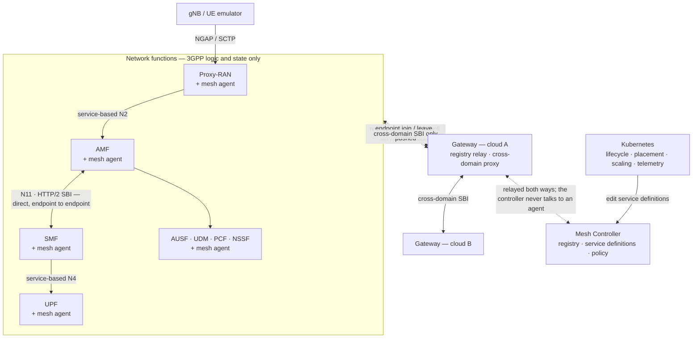

<p align="center">
  
</p>

# Volantis

**A cloud-native 5G/6G mobile core for Kubernetes.**

*Volantis* is Latin for "flying". The name says what the core is built to do: move.
Scale under load, run across clouds, and change where signaling goes — while it keeps
running.

> **Volantis will be open source.** We're waiting on institutional approval to release
> the full source. Parts of it are already out: the protocol layer ships as standalone
> Go libraries — [`sbi`](https://github.com/reogac/sbi),
> [`nas`](https://github.com/reogac/nas), [`ngap`](https://github.com/lvdund/ngap),
> [`pfcp`](https://github.com/reogac/pfcp).
>
> Meanwhile this repo has the Kubernetes manifests and config you need to deploy
> Volantis, and the container images are published — see [STATUS.md](STATUS.md).

---

## Quick start

Two ways in. Run either from the repository root.

### Prerequisites

| deploying on | you need |
|---|---|
| one machine | Linux · the binaries in `bin/` ([how](bin/README.md)) · MongoDB on 27017 · root for the user plane. For the data path: `gtp5g` ≥ 0.8.1 and < 0.9.20, and UERANSIM (verified on v3.3.0) |
| a cluster | Kubernetes and `kubectl` v1.21+ · a `LoadBalancer` provider (`minikube tunnel` will do) · one host beside the cluster to run the UPF, with `gtp5g` loaded |

Unpack the binary bundle at the repository root — it is the only download:

```bash
curl -fL https://github.com/etri/volantis/releases/download/v0.1.1/volantis-v0.1.1.tar.gz | tar -xz -C .
```

Both runners then check the host themselves and name anything missing:
`./deploy/deploy-local.sh check`, `./deploy/deploy-external.sh check`.

### On one machine

You do not need a cluster to see it work. The whole core runs as ten ordinary processes
on one host, driven end to end by a simulated gNB and UE — same binaries, same mesh, same
3GPP procedures, no orchestrator anywhere. It is four commands:

```bash
./deploy/deploy-local.sh check        # what this host is missing, if anything
./deploy/deploy-local.sh start        # control plane, subscribers and the gNB     (no root)
sudo ./deploy/deploy-local.sh upf     # the user plane                             (root)
sudo ./deploy/deploy-local.sh ue 1    # a UE, in its own network namespace         (root)
```

You end with a UE registered and holding a PDU session, carrying ICMP, DNS and HTTP over
a real GTP-U tunnel. Guide: **[deploy/local/README.md](deploy/local/README.md)**.

This is not a demo mode or a simulator. The mesh is *required* to work without an
orchestrator, so registration, discovery, subscription, resolution and liveness all run
exactly as they do in a cluster; instance labels come from config files instead of pod
labels, and that is the whole difference. What a cloud adds is the actuator that creates
the replicas.

### On a cluster

One cluster, one command. Order does not matter — every component retries its way into
the mesh rather than requiring what it depends on to already exist:

```bash
./deploy/k8s/k8s-deploy.sh              # add -n first to see what it would apply
```

That is the whole control plane in the `volantis` namespace. The UPF runs as a process on
a host beside the cluster, because its data path needs the `gtp5g` kernel module; start it
and a gNB and UEs with `deploy/deploy-external.sh`.

Then read **[single-cloud/README.md](deploy/k8s/manifest/single-cloud/README.md)** — it
opens with the quick start for a cluster (the published addresses, the out-of-cluster UPF,
subscribers and a UE) and then covers scaling the AMF and the SMF, and what to look at
when something does not work.

For three clusters sharing one mesh — locality routing, cross-cloud proxying, a controller
in HA — see **[multi-cloud/README.md](deploy/k8s/manifest/multi-cloud/README.md)**.

**Where the images live.** Each network function is published as
`ghcr.io/reogac/volantis-<nf>:<tag>`, tag `v0.1.1` by default. The packages are public, so
pulling needs no registry account — the `reogac` in the path is a GHCR namespace, not a
login. `IMAGE` and `TAG` at the top of
[`deploy/k8s/k8s-deploy.sh`](deploy/k8s/k8s-deploy.sh) are the only place that prefix is
written: point them at a registry of your own to pull from somewhere else, and `-t` picks a
tag for one run. No manifest names a registry.

## What you can do with it

| You can | How |
|---|---|
| Run a 5G core on Kubernetes, register UEs and carry traffic | [single-cloud](deploy/k8s/manifest/single-cloud/README.md) |
| Run the UPF, a gNB and UEs beside any of those clusters | One command per stage, or `e2e` for all of them — [external](deploy/external/README.md) |
| Run the whole core on one machine, no cluster, end to end with UERANSIM | Four commands — [single-machine](deploy/local/README.md) |
| Scale the AMF and SMF while traffic is running | `kubectl scale` — [scaling](#scaling) |
| Change which instances serve a service, with no redeploy | Edit a label selector — [routing](#routing) |
| Run one core across several clusters or clouds | A central cloud and two edges — [multi-cloud](deploy/k8s/manifest/multi-cloud/README.md) |
| Drive the core from your own orchestrator or AI-assisted MANO | Service definitions are the API — [routing](#routing) |

Standard 3GPP procedures, message formats, and service-based interfaces are unchanged,
so existing UE/RAN emulators work as-is.

## Routing

Change which instances serve a service by editing one label selector and re-applying:

```yaml
# deploy/k8s/manifest/single-cloud/service-definitions.yaml
metadata:
  name: smf-001-01-1-010203
spec:
  clusterIP: None
  selector: {app: smf, plmnId: 001-01, slice: 1-010203}
```

Membership changes immediately. Nothing is rebuilt or redeployed, and no network function
changes.

Network functions don't do service discovery. A function says *what service it needs* as a
set of attributes. The mesh matches that against the deployed **service definitions**,
picks an instance, and routes the call. A service definition is a headless Kubernetes
Service: `metadata.name` is the service, `spec.selector` is the membership.

There's no CRD to install — the controller works on `Service` objects, and everything a
core Service cannot say (traffic-routing groups and routes, load balancing policy) rides in
one annotation, `mesh.volantis.io/definition`.

That's also how you plug in your own control loop: an orchestrator edits membership and
routing policy, watches the result through mesh telemetry, and adjusts.

## Scaling

Scale the AMF with plain Kubernetes. No SCTP-aware load balancer, no peer
reconfiguration:

```bash
kubectl -n volantis scale deploy/amf-10-100-dep --replicas=5
```

New pods carry the same labels, so the service definition picks them up and they start
receiving signaling. Existing UE contexts stay on the instance holding them.

Scaling is **capacity-driven, not CPU-driven**: a signaling function at 30% CPU can still
be at its UE ceiling. Every instance publishes its occupancy on `/state` — `uesRegistered`
for an AMF, `sessionsEstablished` for an SMF — and an instance that has not finished
configuring answers `503` rather than reporting full idle capacity. The mesh publishes the
signal and never talks to an autoscaler; the actuator stays outside.
[`single-cloud/README.md` §5](deploy/k8s/manifest/single-cloud/README.md#5-scale-amf-and-smf)
covers what the unit is, the ceilings, how to add a set or a slice, how to drain one
without dropping live contexts, and an example HPA driven by `/state`.

## How it works



**Mesh Controller** — holds the registry, service definitions, and policy. It never talks
to a network function directly: what it pushes goes to the **gateways**, and each gateway
relays it to the agents registered with it. Never on the request path.

**Gateway** — one per cloud, and the only thing an agent talks to. Every agent in that
cloud registers, subscribes, polls for definitions and receives endpoint updates through
it, and the gateway carries the same traffic up to the controller. It also forwards
**cross-domain** SBI calls, twice over: consumer → its own gateway → the producing cloud's
gateway → producer. Calls inside one gateway domain go endpoint to endpoint and skip it
entirely.

**Mesh agent** — a Go library linked into each network function, not a sidecar. It knows
one address, its `registrar` gateway. Through it the agent registers the NF's endpoint and
subscribes to the services the NF consumes; endpoint join/leave arrives pushed, service
definitions on the agent's own poll. What it holds is enough to resolve requests locally,
set up mTLS, and pin stateful contexts to one instance.

**Proxy-RAN** — terminates NGAP and exposes N2 as a service-based interface. The gNB
holds one SCTP association to it, so AMF instances behind it can come and go. This is
what makes AMF scaling possible.

**Service-based N4** — UPFs are discoverable services, so the user plane topology can
change without editing SMF config.

Instance attributes are Kubernetes labels and matching rules are label selectors, so
`kubectl` and anything else that speaks Kubernetes works on the core directly.

**Some components face outside the cluster.** The controller, each cloud's gateway and
Proxy-RAN are published on `LoadBalancer` Services — Proxy-RAN's carries **SCTP** on 38412,
so gNBs reach it like any other Kubernetes workload. The one network function that stays a
host process is the **UPF**, whose data path needs the `gtp5g` kernel module. Everything
else uses ordinary pod networking.

For the design rationale and measurements, see the paper ([citation](#citation)).

## Components

| Component | What it does |
|---|---|
| Mesh Controller | Registry, service definitions, policy distribution |
| Gateway | Per-cloud L7 proxy and registry relay |
| Mesh Agent | In-process library linked into each NF |
| Proxy-RAN | NGAP/SCTP termination, service-based N2, AMF selection |
| DAMF | Default AMF — initial authentication, slice and AMF-set selection, then hands the UE to an AMF |
| AMF, SMF, PCF, UDM, AUSF, NSSF | 3GPP control-plane functions |
| UPF | User plane, kernel data path via `gtp5g` (`0.8.1 ≤ v < 0.9.20`) |

Two things differ from a textbook 5G core:

- **No UDR.** The UDM reads subscriber data from MongoDB directly.
- **Extended NSSF.** It assigns AMF identities and holds config for other NFs. Elastic
  AMF scaling depends on this.

Written in Go, 3GPP Release 18 SBI over HTTP/2.

## Already open source

The protocol layer is generated from 3GPP specs by our own generators and released as
standalone Go libraries. Usable without Volantis.

| Package | What it is |
|---|---|
| [`sbi`](https://github.com/reogac/sbi) | Release 18 SBI clients, server stubs, models |
| [`nas`](https://github.com/reogac/nas) | NAS encoder/decoder |
| [`ngap`](https://github.com/lvdund/ngap) | NGAP encoder/decoder |
| [`pfcp`](https://github.com/reogac/pfcp) | PFCP encoder/decoder |

## UE and RAN emulators

- **[StormSIM](https://github.com/lvdund/StormSIM)** — scalable UE/gNodeB emulator,
  written by one of us.
- **[UERANSIM](https://github.com/aligungr/UERANSIM)** — widely used; good for checking
  standard Release 18 procedures.

## Layout

```
bin/             Where the binaries go — ships only its README
deploy/
  deploy-local.sh  The single-machine deployment: start / stop / status / logs
  local/         Single machine: one loopback address per component,
                 default ports, no orchestrator
  k8s/
    k8s-deploy.sh  Applies a Kubernetes deployment, pinned to one image tag
    manifest/
      single-cloud/  One cluster, one gateway, only the UPF outside it
      multi-cloud/   Three clusters, one mesh: a central cloud and two edges
    helm/          Both deployments as one chart
  deploy-external.sh  The UPF, a gNB and UEs, against any deployment
  external/      The components that run outside a cluster — one copy, shared
src/             Placeholder — see STATUS.md
```

## Contact

Questions, problems, collaboration: `tqtung@etri.re.kr`

## Citation

```bibtex
@article{thai2026volantis,
  title   = {Volantis: A Cloud-Native and Scalable Multi-Cloud
             Next-Generation Mobile Core Network},
  author  = {Thai, Quang Tung and Luong, Vu Dung and Ko, Namseok},
  journal = {Journal of Network and Computer Applications},
  year    = {2026},
  note    = {Under review}
}
```

## License

Apache 2.0 — see [LICENSE](LICENSE). Container images and binaries have separate terms
until the source is released; see [STATUS.md](STATUS.md).

## Acknowledgment

Supported by the ICT R&D program of MSICT/IITP [RS-2024-00405354, Development of Evolved
SBA Framework and Core Technologies of Control/User Plane NFs].
