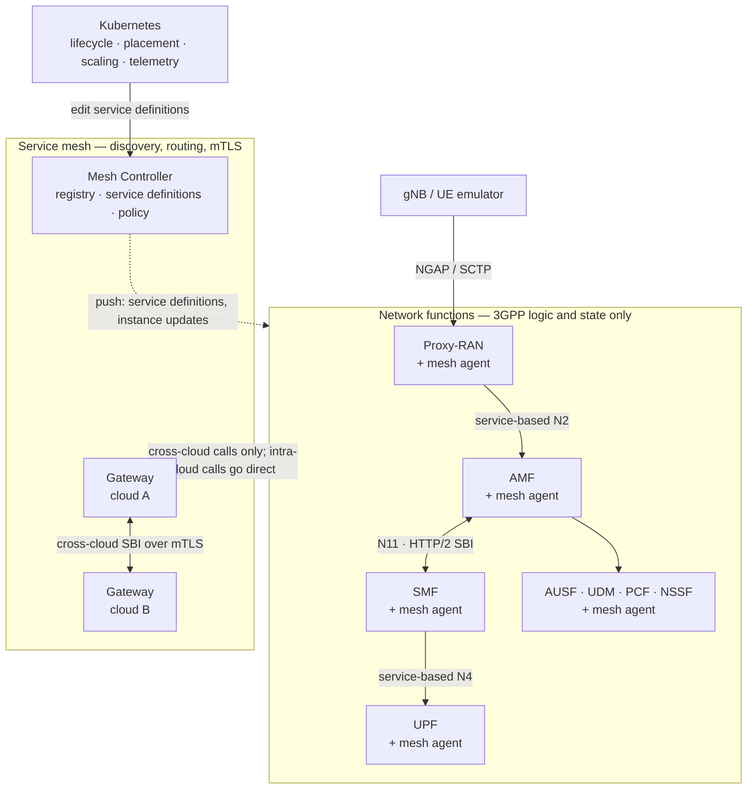

<p align="center">
  
</p>

# Volantis

**A cloud-native 5G/6G mobile core for Kubernetes.**

*Volantis* is Latin for "flying". The name says what the core is built to do: move.
Scale under load, run across clouds, and change where signaling goes — while it keeps
running.

> **Volantis will be open source.** We're waiting on institutional approval to release
> the full source. Parts of it are already out: the protocol layer ships as standalone
> Go libraries — [`sbi`](https://github.com/reogac/sbi),
> [`nas`](https://github.com/reogac/nas), [`ngap`](https://github.com/lvdund/ngap),
> [`pfcp`](https://github.com/reogac/pfcp).
>
> Meanwhile this repo has everything you need to run Volantis without building it:
> container images, Helm charts, Kubernetes manifests, and config. See
> [STATUS.md](STATUS.md).

---

## What you can do with it

| You can | How |
|---|---|
| Run a 5G core on Kubernetes and register UEs | [QUICKSTART.md](QUICKSTART.md) |
| Scale the AMF and SMF up while traffic is running | `kubectl scale`, or the autoscaler — [scaling](#scaling) |
| Change which instance serves a request, with no redeploy | Edit a service definition — [routing](#routing) |
| Run one core across several clusters or clouds | Gateways federate them over mTLS — guide coming |
| Drive the core from your own orchestrator or AI-assisted MANO | Service definitions are the API — [routing](#routing) |

Standard 3GPP procedures, message formats, and service-based interfaces are unchanged,
so existing UE/RAN emulators work as-is.

## Quick start

One cluster, control plane only, no UPF and no kernel module. About 15 minutes.

```bash
minikube start --cpus=4 --memory=8192
helm install volantis-mesh deploy/helm/volantis-mesh -n volantis --create-namespace
helm install volantis-core deploy/helm/volantis-core -n volantis
kubectl apply -f deploy/service-definitions/location-agnostic.yaml
```

Full steps, including subscriber provisioning and running an emulator:
**[QUICKSTART.md](QUICKSTART.md)**.

## Routing

Network functions don't do service discovery. A function says *what service it needs*
as a set of attributes. The mesh matches that against your **service definitions**,
picks an instance, and routes the call.

A service definition is a YAML object. It says which instances serve a service, and how
one gets picked:

```bash
kubectl apply -f deploy/service-definitions/location-aware.yaml
```

That file differs from `location-agnostic.yaml` only in its routing rule. Applying it
changes instance selection immediately. Nothing is rebuilt, nothing is redeployed, and
no network function changes.

This is also how you plug in your own control loop: an orchestrator sets membership and
routing policy, watches the result through mesh telemetry, and adjusts.

See [deploy/service-definitions/](deploy/service-definitions/) for the fields and the
match/route/balance rules.

## Scaling

The AMF and SMF scale horizontally with plain Kubernetes. No SCTP-aware load balancer,
no peer reconfiguration:

```bash
kubectl -n volantis scale deploy/volantis-amf --replicas=5
```

New replicas join the service automatically and start receiving signaling. Existing UE
and PDU session contexts stay pinned to the instance holding them.

The included autoscaler scales on UE and session count rather than CPU, so capacity is
added before signaling backs up.

## How it works



**Mesh Controller** — holds the registry, service definitions, and policy, and pushes
them to agents over HTTP/2. Never on the request path.

**Gateway** — one per cloud. Registers that cloud's instances and carries cross-cloud
SBI calls over mTLS. Intra-cloud calls skip it.

**Mesh agent** — a Go library linked into each network function, not a sidecar. Resolves
requests locally, sets up mTLS, pins stateful contexts to one instance.

**Proxy-RAN** — terminates NGAP and exposes N2 as a service-based interface. The gNB
holds one SCTP association to it, so AMF instances behind it can come and go. This is
what makes AMF scaling possible.

**Service-based N4** — UPFs are discoverable services, so the user plane topology can
change without editing SMF config.

Instance attributes are Kubernetes labels and matching rules are label selectors, so
`kubectl` and anything else that speaks Kubernetes works on the core directly.

For the design rationale and measurements, see the paper ([citation](#citation)).

## Components

| Component | What it does |
|---|---|
| Mesh Controller | Registry, service definitions, policy distribution |
| Gateway | Per-cloud L7 proxy and registry relay |
| Mesh Agent | In-process library linked into each NF |
| Proxy-RAN | NGAP/SCTP termination, service-based N2, AMF selection |
| AMF, SMF, PCF, UDM, AUSF, NSSF | 3GPP control-plane functions |
| UPF | User plane, kernel data path via `gtp5g` v0.10.2 |
| Autoscaler | Scales on UE and session count |

Two things differ from a textbook 5G core:

- **No UDR.** The UDM reads subscriber data from MongoDB directly.
- **Extended NSSF.** It assigns AMF identities and holds config for other NFs. Elastic
  AMF scaling depends on this.

Written in Go, 3GPP Release 18 SBI over HTTP/2.

## Already open source

The protocol layer is generated from 3GPP specs by our own generators and released as
standalone Go libraries. Usable without Volantis.

| Package | What it is |
|---|---|
| [`sbi`](https://github.com/reogac/sbi) | Release 18 SBI clients, server stubs, models |
| [`nas`](https://github.com/reogac/nas) | NAS encoder/decoder |
| [`ngap`](https://github.com/lvdund/ngap) | NGAP encoder/decoder |
| [`pfcp`](https://github.com/reogac/pfcp) | PFCP encoder/decoder |

## UE and RAN emulators

- **[StormSIM](https://github.com/lvdund/StormSIM)** — scalable UE/gNodeB emulator,
  written by one of us.
- **[UERANSIM](https://github.com/aligungr/UERANSIM)** — widely used; good for checking
  standard Release 18 procedures.

## Layout

```
deploy/
  helm/                  Helm charts (mesh, core, autoscaler)
  service-definitions/   Example service definitions
  manifests/             Raw Kubernetes manifests
  host-upf/              UPF host install and gtp5g setup
config/
  nf/                    Sample NF config
  subscribers/           MongoDB subscriber provisioning
images/                  Image list and digests
src/                     Placeholder — see STATUS.md
```

## Contact

Questions, problems, collaboration: `tqtung@etri.re.kr`

## Citation

```bibtex
@article{thai2026volantis,
  title   = {Volantis: A Cloud-Native and Scalable Multi-Cloud
             Next-Generation Mobile Core Network},
  author  = {Thai, Quang Tung and Luong, Vu Dung and Ko, Namseok},
  journal = {Journal of Network and Computer Applications},
  year    = {2026},
  note    = {Under review}
}
```

## License

Apache 2.0 — see [LICENSE](LICENSE). Container images and binaries have separate terms
until the source is released; see [STATUS.md](STATUS.md).

## Acknowledgment

Supported by the ICT R&D program of MSICT/IITP [RS-2024-00405354, Development of Evolved
SBA Framework and Core Technologies of Control/User Plane NFs].
