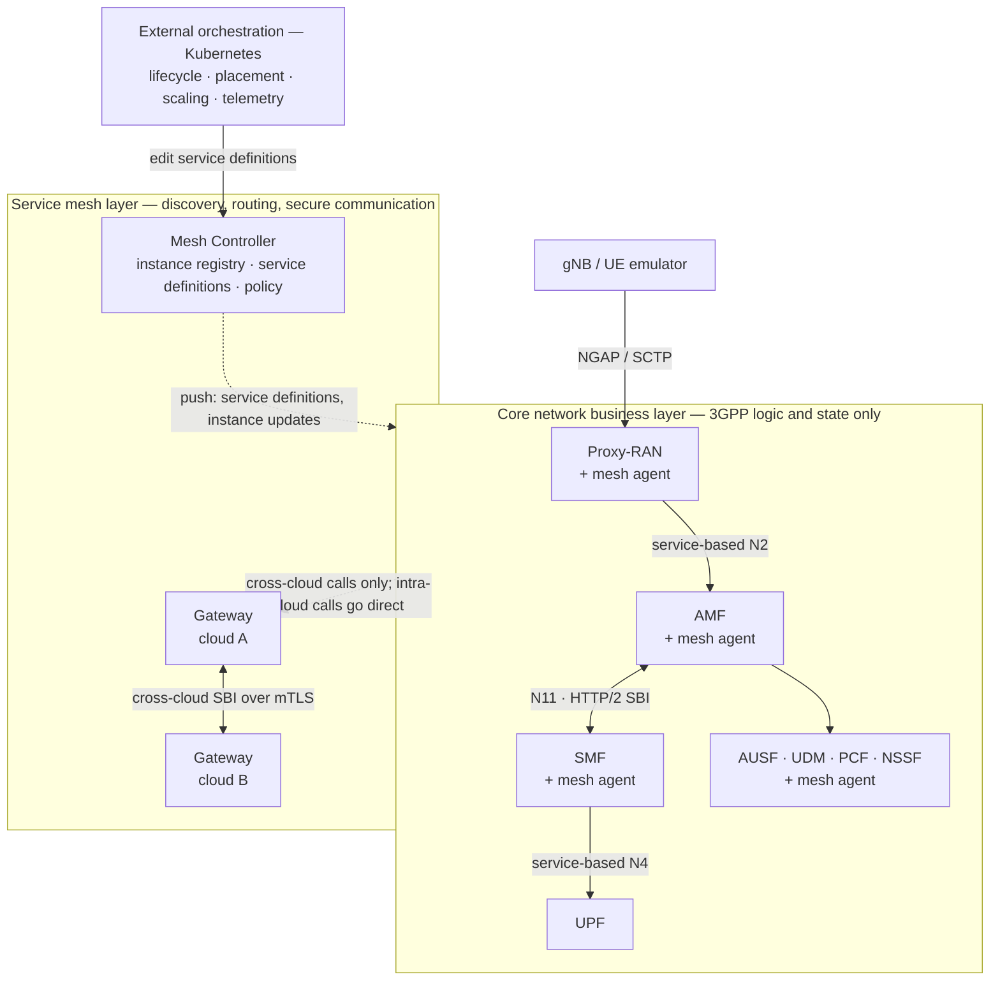

# Volantis

**A cloud-native, multi-cloud next-generation mobile core network.**

> **Status.** This repository currently publishes deployment artifacts — container
> images, Helm charts, Kubernetes manifests, and configuration — so that Volantis can
> be deployed and evaluated without building from source. Release of the full source
> code under an open-source license is planned and pending approval from the
> institution that manages the project. We are committed to this release and will
> update this repository accordingly. See [STATUS.md](STATUS.md).

---

## What Volantis is

Volantis is a mobile core network built for cloud platforms rather than adapted to
them. Existing 5G cores — commercial and open source alike — follow the 3GPP
specification closely and therefore inherit its deployment assumptions: service
discovery through a centralized Network Repository Function (NRF), N2 signaling bound
to NGAP over SCTP, and N4 control bound to static point-to-point PFCP associations.
These bindings make elastic scaling, automated placement, and multi-cloud operation
difficult without manual, vendor-specific machinery.

Volantis changes one thing: **how services are discovered, selected, and
interconnected.** Network functions no longer perform discovery or producer selection.
They declare *what service they need* as a set of attributes, and a built-in service
mesh resolves that declaration against operator-authored **service definitions** and
routes the call — an interaction we call **name-based routing**. Standardized 3GPP
procedures, message formats, and service-based interfaces are unchanged.

Because selection lives in deployment-time definitions rather than in network-function
code, routing becomes programmable: an operator can change how producers are chosen —
by locality, load, latency, or any other policy — by editing a definition, with no
change to any network function.

## Architecture

Volantis is organized into three layers that meet only at a **service identity** — a
selector over instance attributes that names a set of interchangeable instances, never
a specific endpoint or address.



**Core network business layer.** Standardized 3GPP network functions that implement
only protocol semantics and state. Each function delegates communication to an
embedded mesh agent and holds no discovery, selection, or topology logic.

**Service mesh layer.** The deployment-time concerns — discovery, routing, secure
communication, telemetry — owned by three components:

- **Mesh Controller** — the global registry and coordination point. Holds NF instance
  profiles, service definitions, routing intent, and federation policy, and
  distributes them to agents incrementally over HTTP/2. It never sits on the request
  path.
- **Gateways** — one per cloud domain. A gateway relays registration for its cloud's
  agents and carries cross-cloud service calls as Layer-7 SBI calls over mutually
  authenticated (mTLS) channels. Intra-cloud calls bypass gateways entirely, so
  gateway load scales with cross-cloud traffic rather than total signaling volume.
- **Embedded Agents** — linked into each network function as a **library, not a
  sidecar**, keeping the data path short. An agent resolves requests from its local
  view, establishes secure channels, and pins a bound SBI client for the lifetime of a
  stateful context (session affinity).

**Orchestration layer (external).** Standard Kubernetes APIs and controllers. Service
definitions are realized with native Kubernetes constructs: instance attributes are
labels, matching rules are label selectors. Lifecycle, placement, and scaling are
delegated to the platform.

### Bringing N2 and N4 into the mesh

Name-based routing alone does not reach the two 3GPP interfaces that are not
service-based:

- **Proxy-RAN (service-based N2).** Terminates NGAP and exposes N2 signaling as a
  service-based interface, acting as a stable, externally reachable anchor for the
  gNB's SCTP association. AMF instances behind it can be added, removed, or reselected
  without disturbing access-side transport — so the AMF scales horizontally with
  standard Kubernetes mechanisms, with no SCTP-aware load balancer.
- **Service-based N4.** UPFs are represented as discoverable services with stable
  identities, so the user-plane topology can change without static SMF–UPF
  configuration.

## Components

| Component | Role |
|---|---|
| Mesh Controller | Registry, service definitions, policy distribution |
| Gateway | Per-cloud L7 proxy and registry relay |
| Mesh Agent | In-process library linked into each NF |
| Proxy-RAN | NGAP/SCTP termination, service-based N2, AMF selection |
| AMF, SMF, PCF, UDM, AUSF, NSSF | 3GPP control-plane functions |
| UPF | User plane (kernel data plane via `gtp5g`) |
| Autoscaler | Capacity-driven scaling controller |

Two deployment details depart from a textbook 5G core:

- The **UDR is replaced** by direct access from the UDM to a MongoDB store.
- The **NSSF is extended** to assign AMF identities dynamically and to host
  configuration for other network functions, which is what supports elastic AMF
  scaling.

Volantis is implemented in Go and exposes 3GPP Release 18 service-based interfaces
over HTTP/2. The only component not written from scratch is the UPF's kernel data
plane, which builds on [`gtp5g`](https://github.com/free5gc/gtp5g) v0.10.2.

## Repository layout

```
deploy/
  helm/                  Helm charts (mesh, core, autoscaler)
  service-definitions/   Example service definitions, incl. location-aware routing
  manifests/             Raw Kubernetes manifests
  host-upf/              UPF host deployment and gtp5g setup
config/
  nf/                    Per-NF sample configuration
  subscribers/           MongoDB subscriber provisioning
images/                  Container image list and digests
src/                     Placeholder — see STATUS.md
```

## Getting started

See **[QUICKSTART.md](QUICKSTART.md)** — a single-cluster, control-plane-only
deployment that requires no UPF and no kernel module, and ends by changing the routing
policy through a service definition without touching a network function.

## Driving signaling

Volantis works with existing UE and RAN emulators — no modification is required on
their side, since standardized procedures and message formats are unchanged.

- **[StormSIM](https://github.com/lvdund/StormSIM)** — a scalable UE and gNodeB
  emulator for 5G core networks, developed by one of the authors.
- **[UERANSIM](https://github.com/aligungr/UERANSIM)** — widely used UE and gNodeB
  emulator; useful for checking standardized Release 18 procedures.

## Contact

Questions, deployment problems, and research collaboration: `tqtung@etri.re.kr`

## Citation

```bibtex
@article{thai2026volantis,
  title   = {Volantis: A Cloud-Native and Scalable Multi-Cloud
             Next-Generation Mobile Core Network},
  author  = {Thai, Quang Tung and Luong, Vu Dung and Ko, Namseok},
  journal = {Journal of Network and Computer Applications},
  year    = {2026},
  note    = {Under review}
}
```

## License

Deployment artifacts, configuration, scripts, and documentation in this repository are
licensed under the Apache License 2.0 — see [LICENSE](LICENSE). Container images and
prebuilt binaries are distributed under separate terms pending the source code
release; see [STATUS.md](STATUS.md).

## Acknowledgment

This work was supported by the ICT R&D program of MSICT/IITP
[RS-2024-00405354, Development of Evolved SBA Framework and Core Technologies of
Control/User Plane NFs].
