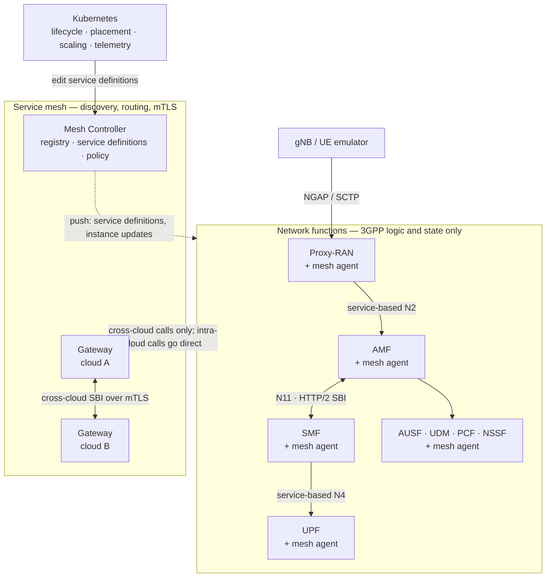

<p align="center">
  
</p>

# Volantis

**A cloud-native 5G/6G mobile core for Kubernetes.**

*Volantis* is Latin for "flying". The name says what the core is built to do: move.
Scale under load, run across clouds, and change where signaling goes — while it keeps
running.

> **Volantis will be open source.** We're waiting on institutional approval to release
> the full source. Parts of it are already out: the protocol layer ships as standalone
> Go libraries — [`sbi`](https://github.com/reogac/sbi),
> [`nas`](https://github.com/reogac/nas), [`ngap`](https://github.com/lvdund/ngap),
> [`pfcp`](https://github.com/reogac/pfcp).
>
> Meanwhile this repo has the Kubernetes manifests and config you need to deploy
> Volantis. Container images aren't published yet — see [STATUS.md](STATUS.md).

---

## What you can do with it

| You can | How |
|---|---|
| Run a 5G core on Kubernetes and register UEs | [QUICKSTART.md](QUICKSTART.md) |
| Scale the AMF and SMF while traffic is running | `kubectl scale`, or the autoscaler — [scaling](#scaling) |
| Change which instances serve a service, with no redeploy | Edit a label selector — [routing](#routing) |
| Run one core across several clusters or clouds | Gateways federate them over mTLS — guide coming |
| Drive the core from your own orchestrator or AI-assisted MANO | Service definitions are the API — [routing](#routing) |

Standard 3GPP procedures, message formats, and service-based interfaces are unchanged,
so existing UE/RAN emulators work as-is.

## Quick start

One cluster, control plane only, no UPF and no kernel module.

```bash
kubectl create namespace etri6g
kubectl apply -f deploy/manifest/nad.yaml
kubectl apply -f deploy/manifest/udr.yaml
kubectl apply -f deploy/manifest/controller.yaml
kubectl apply -f deploy/manifest/gateway.yaml
kubectl apply -f deploy/manifest/services.yaml
kubectl apply -f deploy/manifest/nsm.yaml
```

Then the network functions. Full steps, prerequisites, and how to drive signaling:
**[QUICKSTART.md](QUICKSTART.md)**.

## Routing

Network functions don't do service discovery. A function says *what service it needs*
as a set of attributes. The mesh matches that against the deployed **service
definitions**, picks an instance, and routes the call.

A service definition is a headless Kubernetes Service labeled `type: network-function`.
Its selector is the membership — the instances that can serve it:

```yaml
# deploy/manifest/services.yaml
metadata:
  name: smf-001-01-1-010203
spec:
  clusterIP: None
  selector: {app: smf, plmnId: 001-01, slice: 1-010203}
```

Edit the selector, re-apply, and membership changes immediately. Nothing is rebuilt or
redeployed, and no network function changes. There's no custom API to learn — the
controller's only Kubernetes permission is to watch Services.

That's also how you plug in your own control loop: an orchestrator edits membership and
routing policy, watches the result through mesh telemetry, and adjusts.

## Scaling

The AMF scales with plain Kubernetes. No SCTP-aware load balancer, no peer
reconfiguration:

```bash
kubectl -n etri6g scale deploy/amf-10-100-dep --replicas=5
```

New pods carry the same labels, so the service definition picks them up and they start
receiving signaling. Existing UE contexts stay on the instance holding them.

For capacity-driven scaling, apply an `NFAutoscaler`. It scales on registered UEs and
PDU sessions rather than CPU — 5000 UEs per AMF pod as shipped — so capacity is added
before signaling backs up.

## How it works



**Mesh Controller** — holds the registry, service definitions, and policy, and pushes
them to agents over HTTP/2. Never on the request path.

**Gateway** — one per cloud. Registers that cloud's instances and carries cross-cloud
SBI calls over mTLS. Intra-cloud calls skip it.

**Mesh agent** — a Go library linked into each network function, not a sidecar. Resolves
requests locally, sets up mTLS, pins stateful contexts to one instance.

**Proxy-RAN** — terminates NGAP and exposes N2 as a service-based interface. The gNB
holds one SCTP association to it, so AMF instances behind it can come and go. This is
what makes AMF scaling possible.

**Service-based N4** — UPFs are discoverable services, so the user plane topology can
change without editing SMF config.

Instance attributes are Kubernetes labels and matching rules are label selectors, so
`kubectl` and anything else that speaks Kubernetes works on the core directly.

For the design rationale and measurements, see the paper ([citation](#citation)).

## Components

| Component | What it does |
|---|---|
| Mesh Controller | Registry, service definitions, policy distribution |
| Gateway | Per-cloud L7 proxy and registry relay |
| Mesh Agent | In-process library linked into each NF |
| Proxy-RAN | NGAP/SCTP termination, service-based N2, AMF selection |
| AMF, SMF, PCF, UDM, AUSF, NSSF | 3GPP control-plane functions |
| UPF | User plane, kernel data path via `gtp5g` v0.10.2 |
| Autoscaler | Scales on UE and session count |

Two things differ from a textbook 5G core:

- **No UDR.** The UDM reads subscriber data from MongoDB directly.
- **Extended NSSF.** It assigns AMF identities and holds config for other NFs. Elastic
  AMF scaling depends on this.

Written in Go, 3GPP Release 18 SBI over HTTP/2.

## Already open source

The protocol layer is generated from 3GPP specs by our own generators and released as
standalone Go libraries. Usable without Volantis.

| Package | What it is |
|---|---|
| [`sbi`](https://github.com/reogac/sbi) | Release 18 SBI clients, server stubs, models |
| [`nas`](https://github.com/reogac/nas) | NAS encoder/decoder |
| [`ngap`](https://github.com/lvdund/ngap) | NGAP encoder/decoder |
| [`pfcp`](https://github.com/reogac/pfcp) | PFCP encoder/decoder |

## UE and RAN emulators

- **[StormSIM](https://github.com/lvdund/StormSIM)** — scalable UE/gNodeB emulator,
  written by one of us.
- **[UERANSIM](https://github.com/aligungr/UERANSIM)** — widely used; good for checking
  standard Release 18 procedures.

## Layout

```
deploy/
  manifest/    Kubernetes manifests — mesh, network functions,
               service definitions, autoscalers, telemetry
  config/      Config for components that run outside the cluster (UPF)
images/        Image list and digests
src/           Placeholder — see STATUS.md
```

## Contact

Questions, problems, collaboration: `tqtung@etri.re.kr`

## Citation

```bibtex
@article{thai2026volantis,
  title   = {Volantis: A Cloud-Native and Scalable Multi-Cloud
             Next-Generation Mobile Core Network},
  author  = {Thai, Quang Tung and Luong, Vu Dung and Ko, Namseok},
  journal = {Journal of Network and Computer Applications},
  year    = {2026},
  note    = {Under review}
}
```

## License

Apache 2.0 — see [LICENSE](LICENSE). Container images and binaries have separate terms
until the source is released; see [STATUS.md](STATUS.md).

## Acknowledgment

Supported by the ICT R&D program of MSICT/IITP [RS-2024-00405354, Development of Evolved
SBA Framework and Core Technologies of Control/User Plane NFs].
